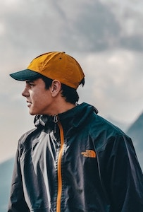

# Especificações do Projeto

As personas foram criadas a partir de entrevistas com pessoas que viajam com frequência, sejam essas viagens de lazer ou a negócios. Foram entrevistadas 5 pessoas com perfis diferentes, para que se pudesse explorar um pouco mais seus hábitos.

## Personas

### Ana Paula Brandão (viajante)

- Idade: 30 anos
- Profissão: Advogada
- Estado Civil: Casada, sem filhos
- Interesses: Viagens internacionais, fotografia, gastronomia

Ana Paula adora viajar e já visitou diversos países da América Latina, Europa e Ásia. Ela gosta de experimentar novas comidas, conhecer diferentes culturas e tirar fotos dos lugares que visita. No entanto, ela costuma ter dificuldades em fazer a mala, principalmente quando vai viajar para lugares com climas diferentes do Brasil. Ana Paula é um pouco vaidosa e gosta de estar sempre bem vestida, especialmente para as fotos. No entanto, como tem uma agenda de trabalho agitada e está focada no desenvolvimento da sua carreira, nem sempre tem tempo para pesquisar sobre o clima e as particularidades do destino para onde está indo. Por isso, planeja mal suas mala e já teve problemas de excesso de bagagem, além de também de não levar as roupas adequadas para o clima. Isso acabou prejudicando sua experiência em algumas viagens.

**Motivação:** Ana Paula espera poder aproveitar cada minuto das suas viagens, tendo tudo aquilo que precisar na hora que precisar, mas sem ter que ficar carregando malas pesadas ou pagando excesso de bagagem. 

**Frustração**: Ana Paula não tem muita habilidade em montar looks e coordenar roupas, o que acaba dificultando ainda mais o processo de planejamento da mala.

### Marcelo Souza (viajante)

- Idade: 25 anos
- Profissão: Estudante de Engenharia
- Estado Civil: Solteiro
- Interesses: Viagens de aventura, trilhas, acampamentos, esportes radicais

Marcelo adora viajar para lugares que ofereçam aventura e desafio. Ele gosta de fazer trilhas, acampar e praticar esportes radicais, como escalada e rapel. Já viajou para diversos lugares do Brasil e da América Latina, mas também já fez algumas viagens para a Europa e a Ásia. Ele costuma levar uma mochila grande em suas viagens e tem habilidade em arrumar seus equipamentos e utensílios de forma compacta e organizada. Marcelo é um cara bastante pragmático. Sabe que algumas roupas e utensílios podem ser usados várias vezes e não vê problemas em ter que lavar suas roupas durante a viagem. Seu lema é curtir a viagem sem estresse.

**Motivação**: Marcelo curte planejar a sua viagem. No entanto, seus registros de viagem não são muito organizados e ele acaba não aproveitando a experiência da viagem anterior no planejamento da nova viagem. Ele busca alguma forma de aproveitar essas experiências anteriores de alguma forma.

**Frustração**: Marcelo encara qualquer aventura que aparece na sua viagem. Ele não gosta, porém, de perder alguma dessas aventuras por estar despreparado, isto é, por ter esquecido algo que seria importante nesses momentos.

## Histórias de Usuários

Com base na análise das personas forma identificadas as seguintes histórias de usuários:

| EU COMO... `PERSONA`| QUERO/PRECISO ... `FUNCIONALIDADE`     | PARA ... `MOTIVO/VALOR`                          |
|---------------------|----------------------------------------|--------------------------------------------------|
| Viajante            | Gerenciar os itens que levo em viagens | Planejar malas com meus próprios itens.          |
| Viajante            | Planejar o que levar em cada viagem    | Não faltar nada e não levar nada em excesso.     |
| Viajante            | Ter um checklist para montar a mala    | Não me esquecer de nada na hora de montar a mala |

## Requisitos

As tabelas que se seguem apresentam os requisitos funcionais e não funcionais que detalham o escopo do projeto.

### Requisitos Funcionais

|ID    | Descrição do Requisito | Prioridade |
|------|------------------------|------------|
|RF-001| O usuário deve poder gerenciar itens de viagem | ALTA | 
|RF-002| O usuário deve poder gerenciar viagens | ALTA |
|RF-003| O usuário deve poder gerenciar etiquetas para os itens | ALTA |
|RF-004| A aplicação deve permitir a geração automática de itens de viagem | MÉDIA |
|RF-005| O usuário deve poder adicionar ou excluir itens para uma viagem | ALTA |
|RF-006| O usuário deve poder marcar itens já separados para uma viagem | ALTA |
|RF-007| Os itens devem ser organizados por etiqueta (palavra-chave) | MÉDIA |
|RF-008| Os itens devem ter um indicador de dias de reuso | MÉDIA |
|RF-009| A aplicação deve permitir marcar itens essenciais | MÉDIA |
|RF-010| A aplicação deve emitir um relatório com os itens selecionados para a viagem | BAIXA |

### Requisitos não Funcionais

|ID     | Descrição do Requisito  |Prioridade |
|-------|-------------------------|----|
|RNF-001| O usuário deve ser capaz de usar a aplicação sem treinamento |  ALTA | 
|RNF-002| A aplicação deve armazenar os dados do usuário de forma segura | ALTA |
|RNF-003| A aplicação deve ser responsiva para rodar em um dispositivos móvel | MÉDIA | 
|RNF-004| A aplicação deve ser compatível com qualquer sistema operacional ou navegador | MÉDIA |

## Restrições

O projeto está restrito pelos itens apresentados na tabela a seguir.

|ID| Restrição                                             |
|--|-------------------------------------------------------|
|REST-001| O projeto deverá ser entregue até o final do semestre |
|REST-002| Não pode ser desenvolvido um módulo de backend        |
|REST-003| A aplicação deve ser desenvolvida apenas com HTML, CSS e JavaScript |
|REST-004| Nenhuma tarefa do projeto pode ser terceirizada |
|REST-005| A documentação e o código da aplicação devem ser publicados no GitHub | 

<a href="https://github.com/ICEI-PUC-Minas-PMV-ADS/pmv-ads-2023-1-e1-proj-web-t06-professor06/blob/main/docs/03-Metodologia.md">próximo</a>

